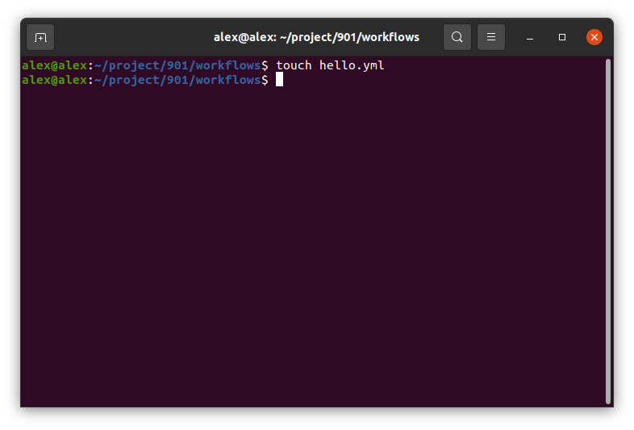
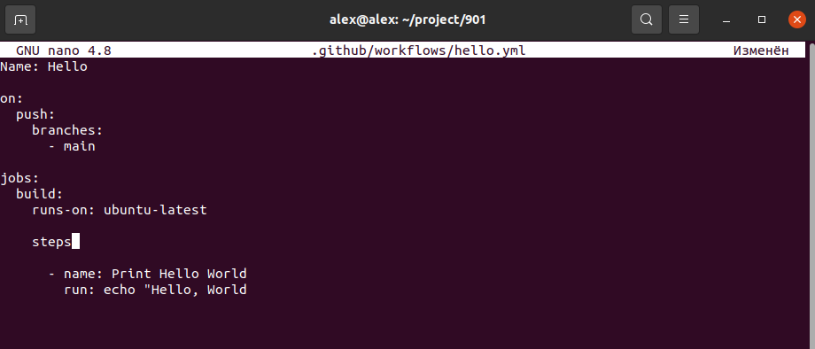
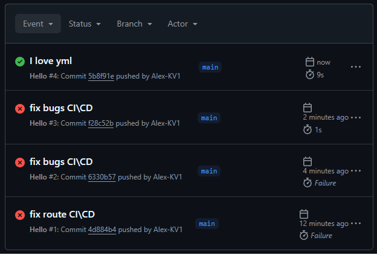
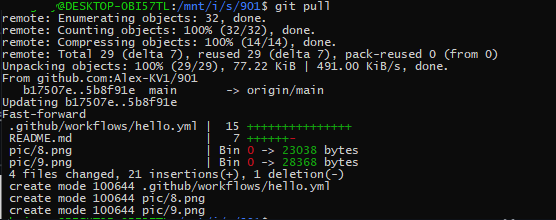
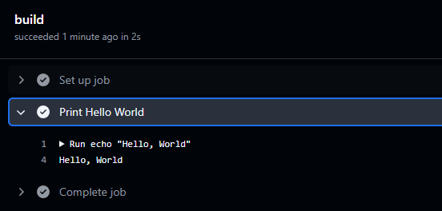

<b>Создание нового репозитория<br>

Создание и управления ветками<br>


<br>
Временное сохранение незафиксированных изменений <br>
<br>
Откат изменений<br>
```reset```
<br>
```Revert```
<br>
Подготовка веток и совмещение (слияние) веток<br>
<br>
<br>
<br>
<br>
<br>

Использование перебазирования<br>
<br>
<br>
Удаление веток<br>
<br>
Работа с логами<br>
<br>
<br>
Полное удаление данных Git включая все его данные из локальной системы.<br>
<br>
<br></b>
Для восстановления локального репозитория можно использовать резервную копию, восстановить локальный репозиторий из удаленного репозитория, использовать инструменты для восстановления данных например Recuva, MiniTool Power Data Recovery<br>

<b>Устройство Git<br>
Содержимое папки .git/<br></b>
<br>
* <b>COMMIT_EDITMSG</b> – этот файл временно содержит сообщение коммита которое мы добавляем командой git commit -m “message”<br>
* <b>HEAD</b> – Указывает на последний коммит текущей ветки репозитория 
* <b>ORIG_HEAD</b> – файл хранит ссылку на последний коммит нужен для восстановления предыдущего состояние репозитория после слияния или перебазирования.
* <b>REBASE_HEAD</b> – используется при перебазировании хранит в себе ссылку (хеш коммита) на коммит который перемещаем в ветку в процессе изменения истории.
* <b>branches/ </b> - папка (директория) которая может содержать ссылки на ветки репозитория. В современном Гит(е) ссылки на ветки хранятся в директории refs/head
* <b>config </b> - файл содержащий конфигурацию  репозитория. Здесь хранятся настройки, такие как имя пользователя, адрес электронной почты, удаленные репозитории и другие параметры, специфичные для данного репозитория.
* <b> description </b> - Этот файл обычно используется для хранения описания репозитория. Он может быть полезен для отображения информации о репозитории в некоторых интерфейсах, таких как GitWeb
* <b> index </b> - Это файл, который представляет собой индекс репозитория. Он хранит информацию о том, какие файлы были добавлены для следующего коммита. Файл index используется в гит для отслеживания изменений, которые осуществляются через коммитит.
* <b> hooks/ </b> - Это директория, в которой хранятся скрипты, которые Git запускает в ответ на определенные события, такие как commit, push, merge и т.д. Это можно использовать для автоматизации задач, таких как проверка кода перед коммитом или отправка уведомлений.
* <b> info/ </b> - Это директория содержит дополнительные файлы информации, такие как exclude, который работает аналогично .gitignore, вобщем здесь вы можно указать файлы и папки, которые Git должен игнорировать.
* <b> logs/ </b> - Эта директория содержит логи всех операций.
* <b> objects/ </b> - Эта директория хранит все объекты Git, такие как коммиты. Каждый объект хранится в виде файла с уникальным SHA-1 хешем. Это основа системы хранения данных в Git.
* <b> packed-refs </b> - Этот файл хранит ссылки на ветки и теги в упакованном формате. Он используется для оптимизации хранения ссылок. Вместо хранения каждой ссылки в отдельном файле, Git может упаковать их в один файл
* <b> refs/ </b> - Эта директория содержит ссылки на ветки и теги репозитория. Внутри нее можно увидеть подкаталоги heads/ (для веток) и tags/ (для тегов). Каждая ветка и тег представляют собой файл, который указывает на последний («головной») коммит.

<b>Сброс состояния репозитория</b>
<br>
<br>
<br>

## Настройка пайплайна на Github

<br>
<br>
Данный скрипт должен лежать по пути от корня репозитория .github/workflows/hello.yml<br>
yml очень чуствителен к регистру и отступам! В смой первой строке Name: Hello ошибка надо писать имя переменной с маленькой буквы name некоторые редакторы которые автоматический исправляют начало строки на врхний регистр могут сыграть злую шутку если вовремя не заметить.<br>
<br>
Подтягивание изменений из удаленного репозитория в локальный репозиторий пк 2
<br>
Так выглядит результат работы пайплайна – печать "Hello, World"<br>
<br>


